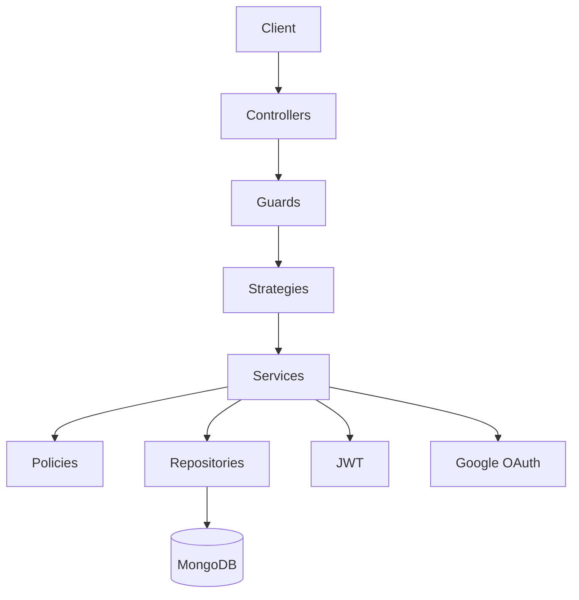
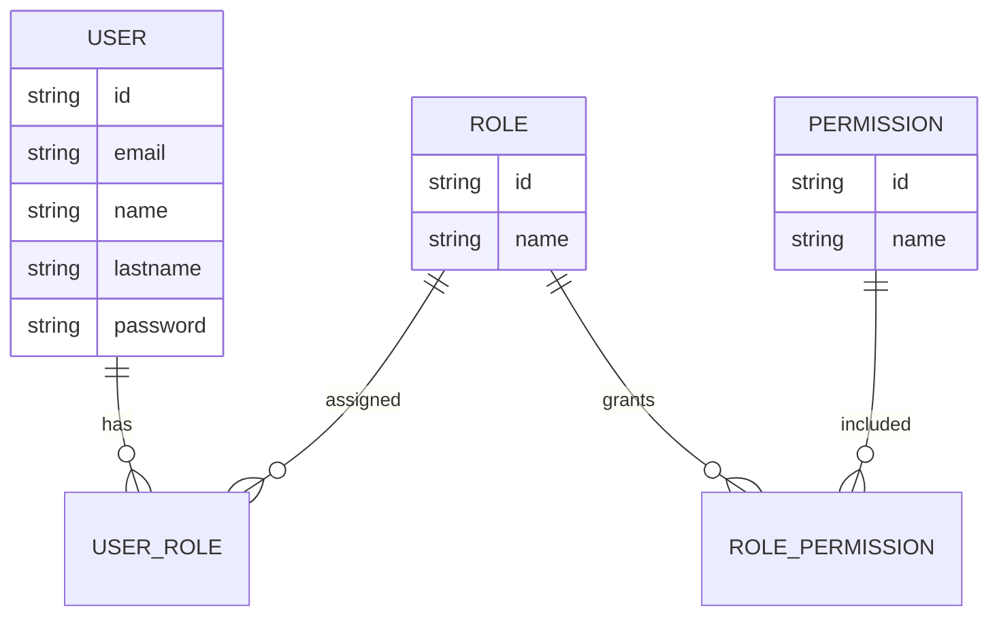
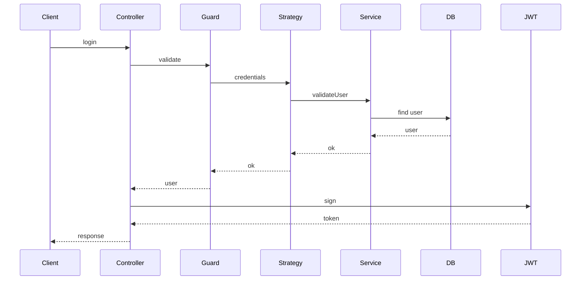
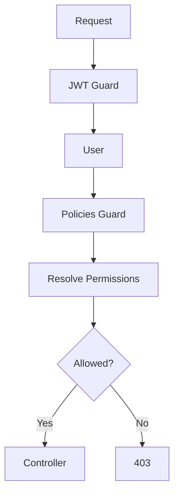

# 🔐 Authentication & Authorization Architecture

## Objective
Document how authentication and authorization are implemented using NestJS, MongoDB, Mongoose, Passport, JWT, and RBAC + Policies.

---

## Architecture Overview



---

## Core Concepts

- Authentication: Who are you?
- Authorization: What can you do?
- JWT: Session mechanism
- RBAC: Role-based access
- Policies: Context-based rules

---

## Modules

- AuthModule
- UsersModule
- RolesModule
- PermissionsModule
- PoliciesModule
- DatabaseModule

---

## Data Model



---

## Auth Flow (Local)



---

## Authorization Flow



---

## Permission Convention

resource.action

Examples:
- user.read
- user.create
- user.update
- user.delete

---

## Design Rules

- JWT issued by app
- Google is provider only
- Permissions stored in DB
- Policies centralized

---

## Request & Response Contracts

### Login
- **Request**: `{ "email": string, "password": string }`
- **Response**: `{ "accessToken": string, "refreshToken": string, "user": UserDto }`
- **Validation**: email (RFC 5322), password (min 8 chars, 1 number, 1 special).

### Google OAuth Callback
- **Request**: Google profile + authorization code handled by Passport strategy.
- **Response**: same shape as login plus `provider: "google"` flag.
- **Validation**: enforce verified email and match against allowlist domain (env var `AUTH_ALLOWED_DOMAIN`).

### Refresh Token
- **Request**: `{ "refreshToken": string }`
- **Response**: `{ "accessToken": string, "refreshToken": string }`
- **Validation**: token signature verification. Token revocation list is planned for a future iteration.

### User DTO
```json
{
  "id": string,
  "email": string,
  "name": string,
  "lastname": string,
  "roles": string[]
}
```

---

## Role & Permission Matrix

| Role        | Permissions                                                                 |
|-------------|------------------------------------------------------------------------------|
| `admin`     | `user.*`, `role.*`, `permission.*`, `policy.*`, `auth.secrets.rotate`        |
| `manager`   | `user.read`, `user.update`, `role.read`, `permission.read`, `policy.read`    |
| `operator`  | `user.read`, `user.create`, `auth.impersonate.request`                       |
| `auditor`   | `user.read`, `role.read`, `policy.read`, `auth.logs.read`                    |
| `guest`     | `auth.login`, `auth.google`, `auth.refresh`                                  |

> `*` implies CRUD suite (`.create`, `.read`, `.update`, `.delete`). Policies module enforces contextual rules (e.g., managers only update users in their org).

Seeders must create roles/permissions based on this table and tag permissions with modules to simplify filtering.

---

## Error Handling Catalog

| Scenario                            | Code | Message                          | Notes                               |
|-------------------------------------|------|----------------------------------|-------------------------------------|
| Invalid credentials                 | 401  | `invalid_credentials`            | Triggered in `LocalStrategy`.       |
| Unauthorized role/policy failure    | 403  | `insufficient_permissions`       | Guard decides before controller.    |
| Expired/invalid JWT                 | 401  | `token_invalid_or_expired`       | Include `www-authenticate` header.  |
| Google profile missing email        | 400  | `google_profile_incomplete`      | Log `profile.id` for audit.         |
| Revoked refresh token               | 401  | `refresh_token_revoked`          | Maintain audit trail.               |
| Rate limit exceeded                 | 429  | `too_many_attempts`              | Backed by Redis sliding window.     |

Errors bubble through Nest filters to ensure consistent JSON `{ "error": string, "message": string, "statusCode": number }`.

---

## External Dependencies & Secrets

- `MONGO_URI`: MongoDB connection string for Mongoose (per environment).
- `JWT_SECRET` & `JWT_EXPIRATION` (seconds), `JWT_REFRESH_SECRET` & refresh TTL (hardcoded 7d currently).
- `GOOGLE_CLIENT_ID` & `GOOGLE_CLIENT_SECRET` for each environment; store in secret manager, never in repo.
- `AUTH_ALLOWED_DOMAIN`: optional domain restriction for Google logins.
- `REDIS_URL`: planned for rate limiting and token revocation (not yet implemented).
- Secret rotation process: rotate refresh secret monthly; access secret weekly. Use `auth.secrets.rotate` permission to gate automation scripts.

Document storage location for .env templates under `infra/environments/*.env.example`.

---

## Testing Strategy

- **Unit**: services, guards, strategies, and policies with mocked repositories (Jest). Cover success/failure for login, refresh, role checks.
- **Integration**: spin up MongoDB + Redis via docker-compose profile `auth-test`; exercise controller endpoints via supertest.
- **E2E smoke**: CI job hitting `/auth/login`, `/auth/refresh`, `/users/me` using seeded fixtures.
- **Security**: add automated checks for weak password rejection and JWT tampering (sign token with wrong secret and expect 401).
- **Observability**: verify audit trail entries for login success/failure and policy denials.

Testing artifacts live under `code/api/test/auth/**` with shared factories in `test/utils/factories.ts`.
